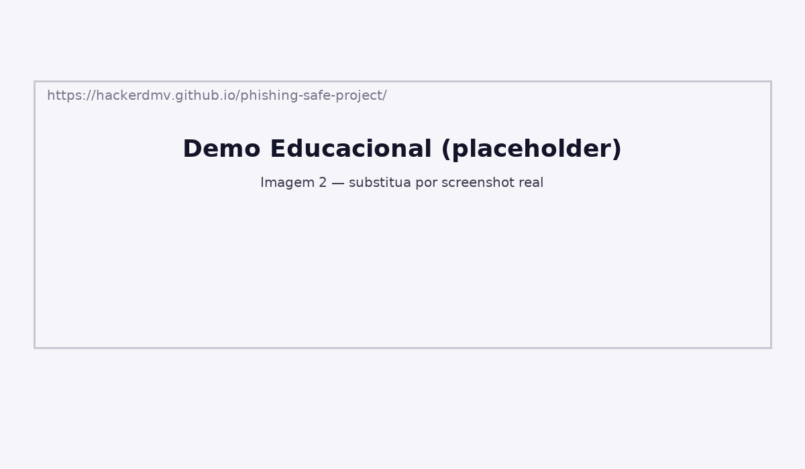

# Projeto Seguro de Phishing — Simulação Educativa ⚔️🛡️

[](LICENSE)  
[](https://hackerdmv.github.io/phishing-safe-project/)  
**Demo online:** https://hackerdmv.github.io/phishing-safe-project/

**Autor:** DR VASQUES (@hackerdmv) — Aprendiz de Hacker Ético.  
**Resumo:** Demonstra o fluxo de phishing em ambiente controlado e ético. A demo NÃO armazena credenciais.


# Projeto Seguro de Phishing — Simulação Educativa ⚔️🛡️

**Autor:** DR VASQUES (@hackerdmv)  
**Resumo curto:** Este repositório demonstra o fluxo de um ataque de phishing **em ambiente controlado e 100% ético**. Aqui a ideia é aprender **a defender**, não a atacar: a demo é local e **não armazena credenciais**.

---

## Por que isso existe
Phishing é poesia mal escrita: imita a forma, enrola a mente e rouba confiança.  
Este projeto mostra o *como* (visão) e o *porquê* (mitigação), sem ensinar golpes. É estudo, é respeito — e é eficácia defensiva.

---

## O que tem aqui
- `demo/mock-page/` — página de login **simulada**. Ao submeter, gera um *token de teste* e exibe mensagem educativa. **Não grava senhas.**
- `demo/detection/detect.py` — detector heurístico didático (pontua URLs suspeitas).
- `docs/analysis.md` — análise técnica e checklist ético de simulações.
- `submission.md` — texto curto para entrega no curso.
- `images/` — sugestão para screenshots (opcional).

---

## Como rodar a demo (modo seguro)
1. Clone:
```bash
git clone https://github.com/hackerdmv/projeto-seguro-de-phishing.git
cd projeto-seguro-de-phishing
```
2. Abra localmente (não publique):
- Abra `demo/mock-page/index.html` no navegador (arraste o arquivo ou `file:///...`).
3. Submeta o formulário — verá mensagem educativa e um token de teste no console. Nada é armazenado em servidores.

---

## Segurança & Ética — LEIA NA VEIA
- **Nunca** execute testes de phishing contra pessoas ou sistemas sem autorização escrita.  
- Use contas e domínios de teste; anonimização e consentimento são obrigatórios.  
- Objetivo: treinar defesa, não explorar vulnerabilidades.

---

## Próximos passos sugeridos (boas ideias de avaliação)
- Integrar o detector a um pequeno dashboard (ex.: Streamlit).
- Rodar campanhas de conscientização autorizadas com Gophish (com consentimento).
- Medir taxa de cliques em usuários-teste autorizados e produzir relatório.

---

## Licença
MIT — veja o arquivo LICENSE.


## Screenshots




